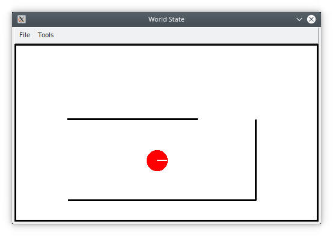
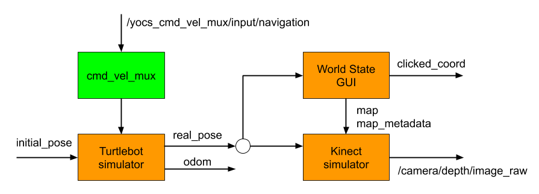

# <span style="color:#00f; font-size: 4em;"> A Very Simple Robot Simulator </span>

A very simple robot simulator that uses cmd_vel_mux nodelet and implements a Kinect like simulator

<p align="center">
  
</p>

## <span style="font-size: 4em;">Install</span>

```sh
cd <workspace_path>/src
git clone https://github.com/kobuki-base/cmd_vel_mux
git clone --branch humble https://github.com/gasevi/very_simple_robot_simulator.git
cd ..
rosdep install --from-paths src --ignore-src --rosdistro $ROS_DISTRO -y
sudo apt install -y ros-humble-image-transport ros-humble-tf-transformations ros-humble-cv-bridge libcv-bridge-dev python3-pil.imagetk python3-opencv
colcon build --symlink-install
```

## <span style="font-size: 4em;">Include package in your ROS environment</span>

```sh
echo "source <workspace_path>/install/local_setup.bash" >> .bashrc 
source .bashrc
```

## <span style="font-size: 4em;">Operation Modes</span>

 * Idle mode: non interactive interface
 * Add Wall mode: press 'w' key to draw a wall on the map with the mouse pointer.
 * Delete Wall mode: press 'd' key to delete a wall.
 * Set Robot Pose mode: press 'p' key to change the robot pose. Drag and drop the robot to change the position. Click outside the robot to change its orientation.

## <span style="font-size: 4em;">Architecture</span>

<p align="center">
  
</p>
